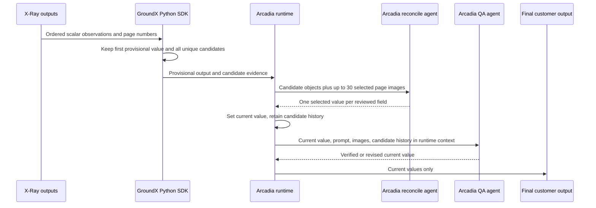

# Design: Delegate scalar candidate resolution to agents

## Goals

- Preserve every distinct scalar value and all source pages until an agent has
  reviewed them.
- Keep the SDK deterministic without encoding business meaning in code.
- Make reconciliation, not SDK ranking, the value-selection boundary.
- Keep the public SDK dataclass shape compatible.
- Build on Internal Arcadia PR 102 batching and its 30-image request limit.

## Non-goals

- Do not add multi-pass or recursive reconciliation.
- Do not increase the 30-image limit.
- Do not put candidate diagnostics in customer final JSON.
- Do not change repeated-record dedupe or relationship matching.
- Do not change field type coercion, prompt schemas, workflow routes, or agent
  response JSON.
- Do not create a new confidence score or make confidence persistence a release
  gate.

## Decisions and rejected alternatives

- Keep the public name `final_output`. Renaming it would break callers. Define
  it as final SDK route reassembly but provisional input to downstream agents
  when alternatives exist.
- Keep `selected` and `alternatives`. Adding a second public candidate-list
  model is unnecessary. Change their documented meaning and retain every value.
- Remove code ranking entirely. Adjusting the ranking would still make business
  decisions before the agent sees the evidence.
- Keep one reconciliation pass. Multi-pass review would add orchestration,
  retries, merged traces, and another agent decision.
- Keep the 30-image limit. Complete page references remain in the prompt, while
  attached images are selected fairly and identified explicitly.

## Ownership

GroundX Python owns generic candidate collection because it reads all X-Ray
custom-output observations and applies workflow routes. Internal Arcadia owns
business interpretation because it has the field prompt, source images,
reconciliation agent, and QA agent.

The cross-repository contract lives in this producer plan. Internal Arcadia
implements the consumer tasks after testing the exact candidate wheel.

## Current behavior

For singular routed fields, GroundX Python calculates a quality tuple from:

1. whether the value looks more specific than hardcoded defaults such as
   `N/A`, `Not Applicable`, or `Not Indicated`;
2. whether source pages exist;
3. confidence.

Lower-ranked values are ignored. Equal-ranked values are retained as
alternatives. A higher-ranked value replaces the selected value and clears the
existing alternatives. Null, empty string, and empty list are skipped before
candidate collection.

Internal Arcadia PR 102 converts retained SDK alternatives into statement
conflicts. Its reconcile prompt renders competing values as an array. Candidate
evidence selects page images, but the prompt does not show which value came from
which pages. Reconciliation clears the pending conflict and writes the agent
value. It does not preserve a previous provisional value when that value was
not already retained by the SDK.

## Candidate identity and order

Candidate collection uses the existing deterministic X-Ray and route traversal
order.

For strings:

- remove leading and trailing whitespace before storing the candidate;
- compare the trimmed value with `casefold()`;
- preserve the first candidate's casing;
- preserve internal whitespace exactly.

For known extracted-field envelopes containing `value` plus metadata such as
`confidence`, candidate identity uses the inner `value`. The first envelope is
retained unchanged except for trimming an inner string value. Later duplicate
envelopes contribute source pages but do not replace the first envelope.
Confidence remains present in the retained envelope when supplied.

For other JSON values, identity is exact and type-sensitive:

- booleans, integers, and floats are distinct types;
- list order is significant;
- mapping key order is not significant;
- nested values remain type-sensitive;
- no scalar, date, number, enum, empty, or default-like coercion is applied.

The first unique candidate becomes `selected` and the field's provisional
`final_output`. Every later unique candidate becomes an `alternative` in first
observed order. A duplicate merges its unique source pages into the existing
candidate in first-seen page order.

## Presence and empty values

Presence is determined before value filtering:

- a missing output key produces no candidate;
- an output key present with null produces a null candidate;
- an output key present with empty string produces an empty-string candidate;
- an output key present with empty list produces an empty-list candidate.

This change applies to singular routed scalar fields. Existing repeated-row
empty-record handling remains unchanged.

## Public SDK compatibility

The public dataclasses remain:

```python
CustomOutputScalarCandidateSet(
    selected=CustomOutputScalarCandidate(...),
    alternatives=(...),
)
```

No new required field is added. The semantic contract changes:

- `selected` means first observed provisional candidate;
- `alternatives` means all later unique candidates;
- `final_output` uses `selected` before downstream reconciliation.

This avoids a generated API or public shape change. Documentation and tests
must stop calling `selected` the best or final value.

## Reconciliation payload

Internal Arcadia builds one review object per conflicting field. The prompt
shows every candidate and its evidence:

```json
[
  {
    "value": "N/A",
    "source_pages": [18],
    "provided_pages": [18]
  },
  {
    "value": "100% immediate",
    "source_pages": [32, 43],
    "provided_pages": [32]
  }
]
```

`source_pages` contains every available page associated with that candidate.
`provided_pages` contains only pages whose images are attached to this model
request. The prompt must tell the agent that unprovided source pages are known
provenance, not visible evidence.

The agent response remains the existing plain field-to-value JSON object. This
keeps parser and retry behavior unchanged.

## Image selection

Image selection is evidence transport, not value selection.

For each field:

1. Deduplicate page images by document page number or canonical page URL.
2. Select the first available page for each unique candidate.
3. If candidate coverage uses fewer than 30 images, add remaining candidate
   pages round-robin in candidate order until the request reaches 30 images or
   no pages remain.
4. Keep every `source_pages` entry in candidate metadata even when its image is
   not attached.
5. Record exact `provided_pages` after image selection.

Candidates with no source page remain in the prompt. If more than 30 candidates
for one field each require a distinct image, raise a clear `ImageEvidenceError`
before the model call. Do not silently omit candidates. Batching may combine
fields only while preserving this per-field coverage.

Multi-pass reconciliation is deferred. It would add orchestration, retry,
trace-merging, and second-decision semantics without evidence that the edge
case occurs often enough to justify that cost.

## Reconcile and QA state

Candidate history and unresolved conflicts are separate concepts:

- candidate history contains all observed values and pages;
- unresolved conflicts indicate that reconciliation still needs to run;
- reconciliation clears the unresolved marker after a valid agent response;
- reconciliation never clears candidate history.

When the reconciliation agent returns a value:

1. Coerce and validate it through the existing field type boundary.
2. Set it as the current routed value.
3. Keep the previous provisional value in candidate history.
4. If the returned value matches an existing candidate, retain that candidate
   and its source pages.
5. If it is novel, append it with `origin: reconcile_agent` and no invented
   source pages.

QA receives the reconciled current value and relevant images. QA must not erase
candidate history. If QA returns a novel value, append it with
`origin: qa_agent` and no invented source pages. The existing customer output
continues to contain the current field value, not the candidate history.

## Confidence

Confidence may remain inside raw candidate envelopes and existing diagnostic
or final-field metadata. It is never used to choose the provisional value,
deduplicate candidates, order candidates, decide whether reconciliation runs,
select images, accept an agent response, or control QA.

Implementation must audit this candidate path for confidence-based branching.
Adding a new customer-facing confidence field is out of scope because it is not
needed to fix evidence loss.

## Sequence



## Error handling

- Missing field: no candidate and no reconcile trigger.
- One unique candidate: no reconcile trigger for candidate conflict alone.
- More than one unique candidate: reconciliation is required regardless of
  value content or confidence.
- Candidate without an image: keep it in the prompt with empty page lists.
- More than 30 distinct candidate images for one field: fail before the model
  call with field name, candidate count, and limit.
- Invalid agent value: preserve existing retry and type-coercion behavior. Do
  not clear pending conflict or candidate history until a valid response is
  accepted.
- Missing candidate metadata after a consumer version mismatch: keep the
  existing non-candidate reconciliation path for legacy field conflicts. Do not
  infer candidate pages.

## Compatibility and rollout

The SDK change intentionally alters which provisional value appears in
`final_output` when candidates compete. Existing consumers that incorrectly
treat SDK `final_output` as agent-resolved may observe a different value. The
public type shape remains compatible, but release notes must call out the
semantic change.

Internal Arcadia must test the exact candidate wheel before the SDK release is
published. After release, it pins that version and reruns the same tests from a
clean install. Deploy only after current reproduction, Arcadia legacy, Arcadia
v1, generic v1, and ADP protected cases pass.

Rollback uses the prior SDK pin and prior Internal Arcadia container image. No
stored data needs migration or repair.

## Interaction with active work

`normalize-extracted-value-types` remains the owner of value type coercion and
parser-output safety. This change must not duplicate or weaken that contract.
Its confidence conversion is metadata validation only and cannot be reused for
candidate ranking. Candidate implementation may share the same released SDK
only if both plans pass their isolated and combined consumer gates.

## No ADR

This is a narrow correction to an existing SDK-to-consumer evidence boundary.
It adds no service, storage system, generated API, or deployment architecture.
